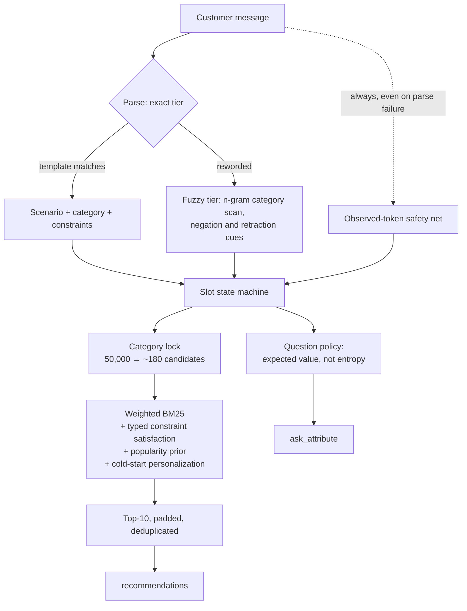

# Shopping Copilot — TikTok TechJam 2026, Track 4

[](https://github.com/Khanna-Aman/techjam-2026-shopping-copilot/actions/workflows/ci.yml)

A stateful conversational shopping agent for the TechJam Conversational E-Commerce Search
Challenge. It finds a hidden target product inside a frozen 50,000-item Amazon catalog by
asking the right questions, remembering the answers, and re-ranking as evidence arrives.

**It runs on the pure Python standard library — no model, no API key, no network access —
and scores 8.5× the official baseline.**

```
                     official baseline        this agent
  Hit Rate@10              0.125       ->       0.995
  MRR                      0.068034    ->       0.757502
  MTTC (turns)             9.81        ->       1.930
  TechnicalScore           0.10671     ->       0.906151      (8.49x)
```

`TechnicalScore = 0.50·HitRate@10 + 0.30·MRR + 0.20·clip((11−MTTC)/10, 0, 1)`

Measured with the **unmodified** official evaluator over the 200 public sessions.
Reproduce with one command: `python -m evaluator.local_evaluator`.

---

## The insight the whole system is built on

The supplied baseline scores 0.107 and converges at turn **9.81 out of 10**. That is not a
retrieval-quality problem. Look at what it returns:

```python
return {"message": "...", "ask_attribute": None, ...}   # starter/baseline_agent.py
```

`ask_attribute` is always `None`. In the simulator, the customer only discloses
information *in response to a question* — so with no question asked, every follow-up turn
returns the same non-answer:

> "Those options are not quite right yet. Ask me about one specific attribute."

The baseline therefore gains **zero new information on every turn after the first** and
re-runs a single OR-query ten times. It is negotiating with itself.

Crucially, the protocol lets one response carry a clarification question **and** a ranked
list at the same time. There is no ask-versus-recommend trade-off to balance — the correct
policy is always to do both. Half the available channel was simply going unused.

That single change is worth **+0.418** of the +0.799 total improvement.

---

## Architecture



```
 customer message
        |
        +--> [ dialogue.py ]  exact templates, then content-driven recovery
        |          |
        |          +--> scenario (buying / browsing / intent override)
        |          +--> category  ------------------+
        |          +--> constraints ---+            |
        |                              v            v
        +--> observed tokens ---> [ slots.py ]  [ catalog.py ]
             (parse-failure net)      |          category buckets
                                      |          weighted BM25 index
                                      |          typed attribute tables
                                      v
                            [ retrieval.py ]  pool -> score -> rank
                                      |
                            [ question.py ]  what is worth asking next
                                      v
                       { message, ask_attribute, recommendations, usage }
```

| Module | Responsibility |
|---|---|
| `copilot/text.py` | Normalisation, tokenisation, the simulator's constraint vocabulary |
| `copilot/catalog.py` | In-memory weighted-BM25 inverted index, category buckets, typed attribute tables |
| `copilot/dialogue.py` | Two-tier message parsing (exact templates → content-driven recovery) |
| `copilot/slots.py` | Constraint accumulation, typing, and override handling |
| `copilot/question.py` | Expected-value clarification policy |
| `copilot/retrieval.py` | Candidate generation, constraint satisfaction, ranking |
| `copilot/agent.py` | Orchestration and the required `Agent` contract |
| `starter/agent.py` | Submission entry point the official harness imports |

Two design choices worth calling out. The index is a **hand-rolled weighted-BM25 inverted
index rather than SQLite FTS5**, because ranking here is dominated by precision inside a
~180-item pool and needs constraint-satisfaction and prior terms that `bm25()` cannot
express. And **field weights are folded into the stored term frequency** — one postings
list carrying a weighted tf, instead of six per-field indexes, for the same ranking effect
at a sixth of the memory.

---

## Five findings that shaped the design

Each was measured, and **three overturned the intuitive answer**.

### 1. The distinctive information is the information you have to ask for

The hidden intent card is built as `[material, colour, feature₀, feature₁]`, where
`hard_constraints` are the first two and `soft_preferences` the rest. Material and colour
are *weak* — thousands of products are "cotton" and "black". The near-identifying strings
are the feature sentences, and those sit in `soft_preferences`, which are **only ever
revealed in response to a question**. This is why Browsing goes from 0.025 to 1.000 once
the agent starts asking.

### 2. Don't erase a retracted preference — it is still true

The obvious reading of Intent Override is "the customer withdrew that, so drop it". That
is wrong, and measurably so. The simulator draws **both** the withdrawn preference and its
replacement from the *same hidden target product*:

```python
old_value = soft[-1]      # from the target
new_value = hard[0]       # also from the target
```

The customer changes their mind; **the target never changes**. The withdrawn value stays
diagnostic. Full erasure scored **worst** of every setting tested. The agent retains it at
half confidence (`override_decay = 0.5`).

### 3. A question that splits the pool perfectly is worthless if nobody answers it

The first information-gain model scored questions purely on how well an answer would
partition the candidate pool. It kept choosing **budget** — which partitions beautifully
and goes unanswered 99.5% of the time.

Measuring P(the customer can answer) across all 50,000 products, using the catalog only
and no session labels:

| attribute | feature | material | colour | style | size | use_case | budget |
|---|---|---|---|---|---|---|---|
| P(yield) | 0.958 | 0.573 | 0.427 | 0.162 | 0.076 | 0.016 | **0.005** |

Folding that in gives an expected-*value* model:

```
value(A) = P(customer can answer A) × E[constraints returned] × how well they split the pool
```

The policy now **derives** that the open-ended question is optimal rather than having it
hardcoded, and yields to a specific question once the open channel is exhausted. Worth
**+0.044**. Two attributes — `category` and `brand` — are excluded outright, because the
simulator's classifier provably never emits them, so asking can never pay.

### 4. Personalization is a cold-start signal, not a ranking signal

The anonymised profile offers generic preference tags ("fit", "comfort", "durability")
that match most of the catalog. As a global ranking term they are **actively harmful**
(−0.040). Applied *only before any constraint is known* — when they are the sole personal
signal available — they help (**+0.015**). Same feature, opposite sign, depending entirely
on when it is applied.

### 5. Paraphrase resistance was worth more than any ranking tweak

The specification warns that the organiser may add natural-language paraphrasing, noting
only that it "cannot decide correctness". Template-exact parsing was betting the entire
score on wording explicitly declared unstable. A perturbation harness confirmed the
exposure, and the fix — content-driven parsing plus a token-level safety net — moved the
worst case from **0.237 to 0.882**.

---

## Reproduce

Python **3.10+**. **No third-party dependencies** — the agent is standard library only.
(`pytest` is needed for the test suite, nothing else.)

```bash
# 1. catalog (18 MB download, expands to 58 MB, 50,000 products)
gh release download participant-kit \
  --repo TechJam2026/techjam-conversational-search \
  --pattern "catalog.jsonl.gz" --pattern "SHA256SUMS"
sha256sum -c SHA256SUMS --ignore-missing     # verify before trusting it
gzip -dkc catalog.jsonl.gz > data/catalog.jsonl

# 2. official score  (~85 s first run incl. index build, ~15 s afterwards)
python -m evaluator.local_evaluator

# 3. everything else
python -m pytest tests/ -q                          # 164 tests
python -m tools.demo --scenario intent_override --index 1
python -m tools.sweep --mode ablation
python -m tools.robustness
python -m tools.proxy_private                       # held-out generalisation
```

The first run builds an index and caches it under `artifacts/` (~52 s, one time). Caching
is best-effort and wrapped in `try/except`: a read-only judging environment simply rebuilds
each run, which is slower but never a failure.

You do not have to take the score on trust. [CI](.github/workflows/ci.yml) runs the test
suite on Linux, macOS and Windows across Python 3.10 and 3.12, then downloads the frozen
catalog from the organiser's own release, runs the unmodified evaluator, and **fails the
build if the result disagrees with [`results/official_evaluation.json`](results/official_evaluation.json)**
on hit rate, MRR, MTTC or the composite score — or if token usage is anything but zero. The
number below is checked by machine on every push. A separate step walks the history back to
the participant kit and fails if any commit touched `evaluator/` or `data/public_set.jsonl`.

See [`DEMO_WALKTHROUGH.md`](DEMO_WALKTHROUGH.md) for a scripted three-minute tour.

---

## Results

### Per scenario

| scenario | n | Hit@10 | MRR | MTTC | baseline Hit@10 |
|---|---:|---:|---:|---:|---:|
| buying | 80 | 1.0000 | 0.6878 | 1.238 | 0.2375 |
| browsing | 80 | 1.0000 | 0.7278 | 1.825 | 0.0250 |
| intent_override | 30 | 0.9667 | 0.9667 | 3.833 | 0.1333 |
| boundary | 10 | 1.0000 | 0.9250 | 2.600 | 0.0000 |
| **overall** | **200** | **0.9950** | **0.7575** | **1.930** | 0.1250 |

Intent Override carries the highest MTTC by construction: a hit only counts *after* the
customer revises their intent on turn 3 or 4, so ~3.5 is close to the structural floor.

### Ablation — one mechanism removed at a time

| configuration | score | Δ |
|---|---:|---:|
| **full system** | **0.9062** | — |
| no clarification | 0.4885 | **−0.4176** |
| no state tracking | 0.5666 | **−0.3395** |
| no popularity prior | 0.8595 | −0.0466 |
| no profile prior (cold start) | 0.8909 | −0.0152 |
| no constraint scoring | 0.8910 | −0.0151 |
| no category lock | 0.8971 | −0.0090 |
| no override handling | 0.9052 | −0.0010 |
| no observed-token fallback | 0.9054 | −0.0008 |
| no top-10 padding | 0.9062 | 0.0000 |
| no MMR diversity | 0.9062 | 0.0000 |

### Robustness — the same sessions, reworded

`tools/robustness.py` imports the evaluator's own simulator functions, so the customer
policy, scoring and scenario mix are identical and **only surface wording changes**. Its
control run reproduces the official score exactly.

| perturbation | before hardening | after |
|---|---:|---:|
| control | 0.8219 | 0.9062 |
| lowercase | 0.8219 | 0.9062 |
| punctuation stripped | 0.4101 | 0.8796 |
| light paraphrase | 0.2691 | 0.8860 |
| heavy paraphrase (+filler, +case drift) | 0.2370 | 0.8824 |

Worst case sits **2.9% below control** (0.8796 vs 0.9062), versus 71% below before
hardening.

### Generalisation — held-out targets the agent was never tuned on

The score above comes from the 200 public sessions. The 800 private ones decide the result,
and "some overfitting risk is unavoidable" is a weaker thing to say than a number.

The public samples carry **no hidden fields** — only a target `parent_asin`, a scenario
label and an anonymised profile. The intent card and the customer's behaviour are
materialised from the catalog product at evaluation time by the organiser's own
`materialize_hidden_fields`. So a session built from a *different* target product is not an
approximation of a real one: it is structurally identical, and `tools/proxy_private.py`
drives it through the **unmodified official `evaluate()` loop**. Only the target differs.

Sampling turned out to be the entire problem. Public targets are nowhere near uniform draws
from the catalog:

| | public targets | whole catalog |
|---|---:|---:|
| median `rating_number` | 6,614 | 12 |
| has `features` | 100% | 90% |
| has `details` | 100% | 97% |
| has a price | 89% | 21% |

Sampling uniformly would have measured a *harder task*, not a generalisation gap. So there
are two regimes:

| regime | n | score | 95% CI | vs public |
|---|---:|---:|---|---:|
| public (official) | 200 | **0.9062** | — | — |
| matched — popularity decile-matched | 110 | 0.8869 | [0.8604, 0.9091] | −0.019 |
| uniform — all eligible targets | 1000 | 0.8648 | [0.8528, 0.8763] | −0.041 |

**The public score sits inside the matched interval**, so on held-out targets of comparable
popularity there is no statistically detectable gap. It sits *outside* the uniform interval,
and that 0.041 is the price of the popularity regularity — the dataset artefact flagged
below, which now has a measurement attached rather than a disclaimer.

The matched regime is capped at 110 sessions because the public 200 have already consumed
most of the catalog's high-review tail, which is why its interval is wide. The match is
close on popularity (median 6,845 against 6,614) but not exact on everything: matched
targets carry a price 55% of the time against 89%. Budget is disclosed in roughly 0.5% of
turns so the residual should be immaterial, but it is a real difference and the tool reports
it rather than reporting only the axis that matched well.

### Feasibility

| | |
|---|---|
| Model / API | **none** on the scored path |
| Token usage | **0** — zero by construction, not by estimate |
| Network access | **none required** — fully offline |
| Monetary cost | **$0** |
| Dependencies | Python standard library only |
| Optional LLM reranking | Implemented, **off by default** — see below |
| Index build | ~52 s cold (one time), ~0.9 s warm from cache |
| Per-turn latency | **37 ms median**, 67 ms p95, 93 ms max |
| Memory | ~225 MB resident with the 50k index loaded |
| Full 200-session evaluation | ~15 s warm, ~85 s including a cold index build |

Measured on an Intel i5-1340P laptop, CPU only, no GPU. Latency is over 600 turns with
constraints accumulating, not just cheap opening turns: cost rises with the number of
confirmed constraints, because each is tested against every candidate in the pool.

**On the optional LLM layer.** [`copilot/llm.py`](copilot/llm.py) implements a semantic
reranking stage over the top candidates. It is disabled by default and gated a second time
behind `COPILOT_LLM=1`, so neither switch alone can start a billed run. This is a
deliberate choice rather than a missing piece: the rules state that official scoring may
disable network access, which makes an agent that *needs* a key a liability. The offline
path is the scored one, and the layer exists so that comparison is measured rather than
assumed — run `python -m tools.sweep --mode llm`.

The dependency is imported lazily *inside* the call, so with the layer off the agent stays
standard-library only; CI asserts this by importing the agent with nothing installed. Every
failure mode — missing key, missing package, rate limit, timeout, refusal, malformed
response — returns the offline ordering unchanged, and a bad response can never shorten the
recommendation list, because a dropped slot can never hit. Token usage is reported honestly
in both modes: zero by construction when off, and the counts the API actually charged when
on.

---

## What was tried and rejected

Reporting only what worked would misrepresent how this was built.

| Idea | Outcome |
|---|---|
| **MMR diversification** of an uncertain top-10 | Sounded right; measured **0.0000** and dominated latency. Off by default, kept behind a flag so its ablation row stays reproducible. |
| **Erasing** the retracted override value | The intuitive reading; the **worst** setting tested. See finding #2. |
| **Entropy-only** question selection | Chose `budget`, which is answered 0.5% of the time. See finding #3. |
| **Global** profile personalization | −0.040. Helps only at cold start. See finding #4. |
| Tuning `w_constraint` from 1.8 → 6.0 | **No effect at all** — constraint satisfaction already dominates ordering, so the weight is inert across that range. Left at its default rather than reported as a tuned win. |

Two mechanisms are kept despite scoring ≈0 on the public set, deliberately. **Top-10
padding** never triggers here but prevents a short list, and an empty slot can never hit.
The **observed-token fallback** costs −0.0008 on clean input while being worth +0.65 under
heavy paraphrase. Both are insurance against the private set, not public-set optimisations.

---

## Limitations and honest caveats

- **Tuned on 200 public sessions; 800 private sessions decide the result.** Weights were
  chosen from flat regions of their sweeps rather than sharp argmaxes, and every mechanism
  derives from the *published protocol* rather than from quirks of the public labels. This
  is now measured rather than argued: on popularity-matched held-out targets the score is
  0.8869, and the public 0.9062 falls inside its 95% interval. Some overfitting risk
  remains — 110 sessions is a wide interval — but it is bounded.
- **Hit Rate is effectively saturated at 0.995** on the public set. Remaining headroom is
  almost entirely MRR (0.7575 of a possible 1.0), so further public-set gains are small
  and increasingly likely to be noise.
- **The popularity prior works partly because of how sessions are sampled.** Targets come
  from a 5-core split, so they carry ≥5 reviews — and in practice far more: their median
  `rating_number` is 6,614 against a catalog median of 12. Abandoning that regularity costs
  **0.041** (uniform 0.8648 vs public 0.9062). It is a dataset regularity rather than
  shopper behaviour, and I would not expect it to transfer to a live catalog. The private
  set shares the sampling, so it should transfer *there*.
- **The paraphrase harness is my model of paraphrasing, not the organiser's.** It rewords
  chrome while preserving payload. A paraphraser that also rewrites *product attributes*
  would degrade the agent further, and I have not simulated that.
- **No semantic retrieval.** Matching is lexical, so a customer describing a product in
  words that never appear in its metadata is served poorly.

## What I would do next

1. **Dense retrieval, still offline.** Encode the 50k catalog once on a GPU, ship a ~38 MB
   fp16 array, and cosine-rerank in memory. Inference stays CPU-only and network-free, so
   the offline guarantee is preserved. Biggest remaining quality lever, and it addresses
   the lexical-matching limitation directly.
2. **An optional LLM reranking layer**, environment-gated and **off by default**, with the
   offline path remaining the scored one — the rules warn that official scoring may disable
   network access, so an agent that *needs* a key is a liability, not a feature.
3. **Question selection over the true posterior** rather than per-attribute priors: keep a
   distribution over candidate products and choose the question that minimises expected
   posterior entropy.

---

## Submission compliance

| Requirement | Status |
|---|---|
| Exports `Agent` with `reset` / `respond` | `starter/agent.py` (and `copilot/agent.py`) |
| Official evaluator unmodified | Yes — enforced by CI, which fails if any commit touches `evaluator/` |
| Public labels and docs unmodified | Yes — same CI check covers `data/public_set.jsonl` |
| Requires network access | **No.** Fully offline; declared explicitly |
| Offline fallback | Not applicable — offline *is* the primary path |
| Model choice, cost, token usage, latency disclosed | Yes — see Feasibility. Zero tokens, $0, 37 ms median on the scored path |
| Optional external service | `copilot/llm.py`, **disabled by default** and gated behind `COPILOT_LLM=1`. Never used for scoring; absent it, the agent is unchanged |
| Secrets in repo | None. No API keys, no credentials, no `.env` |
| Python version | 3.10+ — CI covers 3.10 and 3.12 on Linux, macOS and Windows |
| Dependencies | Standard library only; `pytest` for tests, `anthropic` only for the optional layer |
| Catalog redistributed | **No** — `data/catalog.jsonl` is git-ignored, downloaded from the official release and checksum-verified |
| Reads private or organizer-only data | No. The agent opens only the frozen catalog |

**Ablations never edit the evaluator.** Configuration is injected through `AgentConfig`,
or via the `COPILOT_CONFIG` environment variable (a JSON object of field overrides) on the
harness path. With that variable unset, the agent runs its documented defaults.

## Contributions

Solo entry — Aman Khanna. Architecture, implementation, benchmarking and documentation.
Built with assistance from Claude (Anthropic) as a coding tool, in the same sense as an IDE
or a linter; all design decisions and findings above were verified by measurement against
the official evaluator in this repository.

## Data attribution

Catalog and sessions derive from **Amazon Reviews 2023** (McAuley Lab, UCSD), packaged and
frozen by the TechJam organisers. See [`DATA_ATTRIBUTION.md`](DATA_ATTRIBUTION.md). The
catalog is not redistributed in this repository. The organiser's original participant-kit
README is preserved at [`docs/PARTICIPANT_KIT_README.md`](docs/PARTICIPANT_KIT_README.md).
