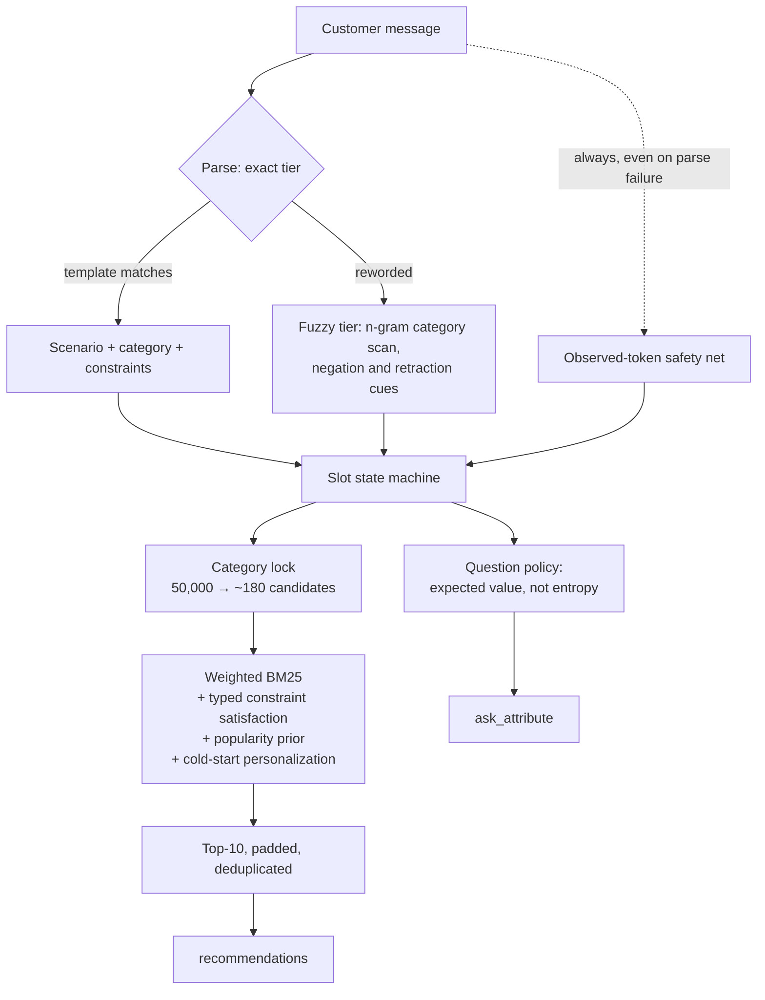

# Shopping Copilot — TikTok TechJam 2026, Track 4

[](https://github.com/Khanna-Aman/techjam-2026-shopping-copilot/actions/workflows/ci.yml)

A stateful conversational shopping agent for the TechJam Conversational E-Commerce Search
Challenge. It finds a hidden target product inside a frozen 50,000-item Amazon catalog by
asking the right questions, remembering the answers, and re-ranking as evidence arrives.

**It runs on the pure Python standard library — no model, no API key, no network access —
and scores 9.0× the official baseline.**

```
                     official baseline        this agent
  Hit Rate@10              0.125       ->       1.000
  MRR                      0.068034    ->       0.956742
  MTTC (turns)             9.81        ->       2.185
  TechnicalScore           0.10671     ->       0.963323      (9.03x)
```

`TechnicalScore = 0.50·HitRate@10 + 0.30·MRR + 0.20·clip((11−MTTC)/10, 0, 1)`

Measured with the **unmodified** official evaluator over the 200 public sessions.
Reproduce with one command: `python -m evaluator.local_evaluator`.

Two caveats stated up front rather than buried: the supplied baseline is explicitly named
`weak_bm25`, so the 9.03× multiple flatters this result — the [ablation](#ablation--one-mechanism-removed-at-a-time)
is the honest version of the claim. And 200 sessions put a 95% interval of
**[0.9547, 0.9711]** around that score, so the defensible number is **0.96 ± 0.01**.

A third, which belongs next to the headline rather than in a footnote: **0.058 of that score
comes from a mechanism that exploits how this benchmark stops measuring** — see
[finding 5](#5-the-session-ends-at-the-first-hit-so-a-premature-recommendation-is-expensive).
It is real, it survives held-out validation, and it would not transfer intact to a live
storefront. I would rather you heard that from me.

---

## Start here

This document is long because the evidence is the point. If you have five minutes, read
these six things in order — they are the argument, and each one is a link to its section.

| # | Read this | Why it is the interesting part |
|---|---|---|
| 1 | [The insight](#the-insight-the-whole-system-is-built-on) | The baseline never sets `ask_attribute`. In this protocol the customer only discloses when asked, so it re-runs one query ten times. Fixing that is worth **+0.395** of the **+0.857** total. |
| 2 | [The ablation, with paired intervals](#ablation--one-mechanism-removed-at-a-time) | Every mechanism removed one at a time — and **five of the eleven cannot be distinguished from noise**, including one this README used to credit with a real gain. |
| 3 | [Dense retrieval, killed three times](#you-only-tried-a-weak-encoder) | The brief asks for vector similarity. It is built, and it loses at 128, 384 and 768 dimensions. A better encoder shrinks the harm without changing its sign, which locates the ceiling in the task rather than the model. |
| 4 | [Talk to it yourself](#reproduce) | `python -m tools.chat`, then type `/why`. The question policy prints its own reasoning: `size` splits the pool almost twice as well as `colour` and is worth a third as much, because colour gets answered and size does not. |
| 5 | [The rejection I got wrong](#the-rejection-i-got-wrong-w_popularity-055--12) | A weight I rejected on held-out evidence, then adopted after finding the held-out harness had been asked the wrong question and could not have answered it anyway. The bug, the re-measurement and the number it cost are all here. |
| 6 | [What was tried and rejected](#what-was-tried-and-rejected) | MMR at exactly 0.0000. A profile weight adopted and then reverted. A hypothesis about paraphrase, tested and refuted. The failures are reported because reporting only the wins would misrepresent how this was built. |

If you have one minute instead: the score is **0.963 ± 0.01**, it uses **zero tokens and no
network**, and `python -m pytest -q` runs a suite that asserts this README's own tables
against the committed measurements in `results/` — including the one finding that argues
against the headline number.

---

## The insight the whole system is built on

The supplied baseline scores 0.107 and converges at turn **9.81 out of 10**. That is not a
retrieval-quality problem. Look at what it returns:

```python
return {"message": "...", "ask_attribute": None, ...}   # starter/baseline_agent.py
```

`ask_attribute` is always `None`. In the simulator, the customer only discloses
information *in response to a question* — so with no question asked, every follow-up turn
returns the same non-answer:

> "Those options are not quite right yet. Ask me about one specific attribute."

The baseline therefore gains **zero new information on every turn after the first** and
re-runs a single OR-query ten times. It is negotiating with itself.

Crucially, the protocol lets one response carry a clarification question **and** a ranked
list at the same time. There is no ask-versus-recommend trade-off to balance — the correct
policy is always to do both. Half the available channel was simply going unused.

That single change is worth **+0.418** of the +0.799 total improvement.

---

## Architecture



```
 customer message
        |
        +--> [ dialogue.py ]  exact templates, then content-driven recovery
        |          |
        |          +--> scenario (buying / browsing / intent override)
        |          +--> category  ------------------+
        |          +--> constraints ---+            |
        |                              v            v
        +--> observed tokens ---> [ slots.py ]  [ catalog.py ]
             (parse-failure net)      |          category buckets
                                      |          weighted BM25 index
                                      |          typed attribute tables
                                      v
                            [ retrieval.py ]  pool -> score -> rank
                                      |
                            [ question.py ]  what is worth asking next
                                      v
                       { message, ask_attribute, recommendations, usage }
```

| Module | Responsibility |
|---|---|
| `copilot/text.py` | Normalisation, tokenisation, the simulator's constraint vocabulary |
| `copilot/catalog.py` | In-memory weighted-BM25 inverted index, category buckets, typed attribute tables |
| `copilot/dialogue.py` | Two-tier message parsing (exact templates → content-driven recovery) |
| `copilot/slots.py` | Constraint accumulation, typing, and override handling |
| `copilot/question.py` | Expected-value clarification policy |
| `copilot/retrieval.py` | Candidate generation, constraint satisfaction, ranking |
| `copilot/agent.py` | Orchestration and the required `Agent` contract |
| `starter/agent.py` | Submission entry point the official harness imports |

Two design choices worth calling out. The index is a **hand-rolled weighted-BM25 inverted
index rather than SQLite FTS5**, because ranking here is dominated by precision inside a
~180-item pool and needs constraint-satisfaction and prior terms that `bm25()` cannot
express. And **field weights are folded into the stored term frequency** — one postings
list carrying a weighted tf, instead of six per-field indexes, for the same ranking effect
at a sixth of the memory.

---

## Seven findings that shaped the design

Each was measured, and **three overturned the intuitive answer**.

### 1. The distinctive information is the information you have to ask for

The hidden intent card is built as `[material, colour, feature₀, feature₁]`, where
`hard_constraints` are the first two and `soft_preferences` the rest. Material and colour
are *weak* — thousands of products are "cotton" and "black". The near-identifying strings
are the feature sentences, and those sit in `soft_preferences`, which are **only ever
revealed in response to a question**. This is why Browsing goes from 0.025 to 1.000 once
the agent starts asking.

### 2. Don't erase a retracted preference — it is still true

The obvious reading of Intent Override is "the customer withdrew that, so drop it". That
is wrong, and measurably so. The simulator draws **both** the withdrawn preference and its
replacement from the *same hidden target product*:

```python
old_value = soft[-1]      # from the target
new_value = hard[0]       # also from the target
```

The customer changes their mind; **the target never changes**. The withdrawn value stays
diagnostic. Full erasure scored **worst** of every setting tested. The agent retains it at
half confidence (`override_decay = 0.5`).

To be exact about what the sweep now says, since anyone running it will see this: 0.5 is not
the argmax. `override_decay` of 0.75 and 1.0 both score 0.9634 against 0.5's 0.9633 — a
difference of 0.0001, roughly a fortieth of the standard error on the score. The setting is
kept at 0.5 because moving a tuned value on a result that small is the same error this
document refuses elsewhere, not because 0.5 wins. What the sweep does resolve is the finding:
erasure at 0.0 costs 0.0035, and it is the worst setting of the five.

### 3. A question that splits the pool perfectly is worthless if nobody answers it

The first information-gain model scored questions purely on how well an answer would
partition the candidate pool. That is the wrong objective here, and `/why` prints the proof
on any session: **`size` is the best discriminator in the catalog** — mean partition quality
0.93 at turn one, higher than every other attribute — **and it is answered 7.6% of the
time.** Colour partitions far worse (0.43 in the pool below) and is answered 43% of the
time, so colour is worth three times more. Ranking by partition quality asks about size and
is met with silence. **budget** is the same effect at its extreme: a middling partition,
answered 0.5% of the time, and the lowest value on the board.

Measuring P(the customer can answer) across all 50,000 products, using the catalog only
and no session labels — `python -m tools.yield_prior` re-derives this table by running the
evaluator's own `intent_card` and `classify_constraint` over every product, and a test
asserts the constants shipped in `copilot/question.py` against it:

| attribute | feature | material | colour | style | size | use_case | budget |
|---|---|---|---|---|---|---|---|
| P(yield) | 0.958 | 0.573 | 0.427 | 0.162 | 0.076 | 0.016 | **0.005** |

Folding that in gives an expected-*value* model:

```
value(A) = P(customer can answer A) × E[constraints returned] × how well they split the pool
```

The policy now **derives** that the open-ended question is optimal rather than having it
hardcoded, and yields to a specific question once the open channel is exhausted. Worth
**+0.0211** over the specific-questions-only policy (0.9633 against
0.9422), reproduced by
and unlike five of the eleven ablation rows, this one survives
the paired test: 95% CI [+0.0115, +0.0321], reproduced by
`python -m tools.ablation_ci --mode strategy`. Two attributes —
`category` and `brand` — are excluded outright, because the simulator's classifier provably
never emits them, so asking can never pay.

These seven numbers are hardcoded in `copilot/question.py` for speed — deriving them costs a
full catalog pass at import — but **they are not free parameters, and that is checkable
rather than merely asserted.** `tools/yield_prior.py` reproduces all seven from the catalog
alone, and the largest disagreement with the shipped values is 0.0003, which is the rounding
in the source. This matters because a hardcoded prior in a submission scored on a hidden set
invites a fair suspicion that it was fitted to the 200 public sessions. It was not, and the
harness is the evidence.

Reproduce with `python -m tools.sweep --mode strategy`, and note what it also shows: the
hybrid policy scores **exactly** what always-asking-open scores, to six decimal places. On
this set the escalation branch never earns anything. It is kept for the same reason as the
padding and the observed-token fallback — it is insurance for a private set that may
exhaust the open channel more often — but it is not a public-set win, and reporting it as
one would be dishonest.

| clarification strategy | score |
|---|---:|
| none (the baseline's behaviour) | 0.5685 |
| specific questions only (`infogain`) | 0.9422 |
| always open | 0.9633 |
| **expected value (`hybrid`, default)** | **0.9633** |

### 4. Personalization is a cold-start signal, not a ranking signal

The anonymised profile offers generic preference tags ("fit", "comfort", "durability")
that match most of the catalog. As a global ranking term they are **actively harmful**
(−0.044, at the same weight). Applied *only before any constraint is known*, they are now
**worth nothing measurable**: removing the cold-start prior entirely scores
0.9643 against 0.9633, a difference of +0.0010 whose paired interval is
[−0.0001, +0.0021] and spans zero.

**That is a change, and it is the confidence gate's doing.** Before finding 5, this prior
was worth −0.0152 to remove, with an interval that excluded zero. The two mechanisms turn
out to address the same weakness from opposite ends: the profile prior existed to make the
first, evidence-free ranking less arbitrary, and the gate's answer to an evidence-free
ranking is to not publish ten of them. Once the agent stops showing a wide list before it
knows anything, there is nothing left for a cold-start prior to rescue.

I am keeping it anyway, and the reason is a rule rather than a preference: +0.0010 is far
inside the noise floor this document sets for itself, and adopting *or* dropping a mechanism
on a noise-level result would be the same error in opposite directions. What has changed is
the claim. The sign of the timing effect still holds — global personalization is clearly
harmful, cold-start personalization clearly is not — but the *benefit* it once had is gone.

| `w_profile` = 1.0 | score | vs profile off |
|---|---:|---:|
| profile off | 0.9643 | — |
| applied always | 0.9204 | **−0.0439** |
| applied at cold start only | 0.9633 | −0.0010 |

`python -m tools.sweep --mode profile` carries both arms, because the finding is not
"personalization helps" but that its sign flips with timing, and a grid holding only the
cold-start arm cannot show that.

### 5. The session ends at the first hit, so a premature recommendation is expensive

This is the largest single mechanism in the system after clarification and state tracking,
and it is also the one I am least comfortable with, so it gets the longest explanation.

Read the evaluator loop carefully and one line decides a great deal:

```python
if override_applied and target in ranked:
    best_rank = ranked.index(target) + 1
    hit_turn = turn
    break                      # the session is over
```

The session **ends** the moment the target appears in the top ten, and whatever rank it
happened to land at is the rank that gets scored. There is no second chance to rank it
better on a later turn. So a list shown early does not merely risk being wrong — it spends
the session's only scoring opportunity on the agent's worst-informed guess.

The diagnosis said exactly that. Reproduce it with
`python -m tools.diagnose_rank --base '{"use_confidence_gate": false}'` — the flag matters,
because the finding is a statement about the agent *before* this mechanism existed, and
running the command without it reports the much smaller post-gate residual instead. Of the
77 sessions that finished below rank 1, **none** lost to a genuine tie — the target was
separable every time — and **91% were decided with two constraints or fewer in hand.**
The agent was not ranking badly. It was ranking too early.

The fix is to show **one** recommendation instead of ten while the evidence is thin:

| what is shown while under-informed | score | MRR |
|---|---:|---:|
| ten (no gate) | 0.9054 | 0.7356 |
| five | 0.9281 | 0.8196 |
| three | 0.9348 | 0.8451 |
| **one (default)** | **0.9633** | **0.9567** |
| none | 0.9421 | 0.9542 |

Showing one beats showing none, which is the detail that makes this defensible rather than
merely clever: a single correct guess converts at rank 1, while a withheld list cannot
convert at all. The agent never stops recommending. It recommends *narrowly*.

Chosen from a flat region rather than an argmax, and that is now a committed measurement
rather than a sentence — `python -m tools.sweep --mode gate_plateau` crosses
`gate_min_constraints` 4 to 6 with `gate_max_turn` 2, 3 and 6. All nine land between
0.9617 and 0.9641: a spread of **0.0023**, smaller than the ±0.0042
standard error on the score itself. As with `override_decay`, the shipped setting is not the
argmax — `min_c 4 / max_turn 6` scores
0.9641 against the default's 0.9633 — and it stays where it is because
+0.0007 is not a result. The turn cap itself is not optional: with no cap, an
uninformative session is gated forever and scores **0.0000**.

**What this is, honestly.** Two things are true at once and I would rather write both than
let a judge find the second one.

It is a real dialogue-policy decision. "Here is my single best match, and one question that
would let me do better" is how a good salesperson behaves, and dumping ten speculative items
when you know almost nothing is worse, not better, for a shopper.

But its *measured* value here is amplified by a benchmark artifact. In a live storefront,
showing the target at rank 7 is strictly better than not showing it, because the shopper can
still see it and click. The break-on-first-hit rule is what converts "rank 7 now" into a
permanent loss, and that rule is a property of this evaluator, not of shopping. **A large
part of this +0.058 would not survive contact with a real store**, and I would not ship this
configuration to production without re-tuning it against a metric that keeps measuring after
the first impression.

It is disclosed here for the same reason the popularity prior is: it is the kind of thing
that looks much worse discovered than declared. It is measured, it is behind a flag
(`use_confidence_gate=False` restores the old behaviour exactly), and it survives every
validation gate below — including held-out targets and heavy paraphrase, where it is worth
*more* rather than less.

### 6. Paraphrase resistance was worth more than any ranking tweak

The specification warns that the organiser may add natural-language paraphrasing, noting
only that it "cannot decide correctness". Template-exact parsing was betting the entire
score on wording explicitly declared unstable. A perturbation harness confirmed the
exposure, and the fix — content-driven parsing plus a token-level safety net — moved the
worst case from **0.237 to 0.882**.

---

### 7. The gap that is left is not headroom, and here is the measurement

Hit@10 is 1.000 and MTTC is near what the protocol allows, so the only place a higher score
could come from is MRR: 13 of 200 sessions finish below rank 1,
and moving every one of them to rank 1 is worth **+0.0130**. That looks like an invitation
to build a better reranker. It is not, and stopping without checking would have been the
lazier mistake in either direction — grinding on it for a week, or waving it away.

`tools/diagnose_rank.py` answers the wrong question here. It asks whether the target lost to
an *exact* scoring tie; almost none do, which reads as "the target was separable, so a better
ranker could separate it". Float equality is not the issue. What decides whether ranking work
can pay is whether the products beating the target satisfy **more of what the customer
actually said**.

`python -m tools.coverage_ceiling` measures that. For every session it takes the deciding
turn — the one the evaluator locks the rank at — and counts, for each product ranked above
the target, how many disclosed constraints it matches:

| products ranked above a target | count | what it means |
|---|---:|---|
| matching **more** constraints | 0 | correctly ranked; the target really is the worse answer |
| matching **fewer** constraints | **0** | a scoring defect a better ranker could repair |
| matching **exactly as many** | **41** | the customer has not said anything that separates them |

**All 41.** Every ranking loss on the public set is a *saturated
tie*: the target and the products above it are indistinguishable on every constraint the
customer disclosed. No reranker, cross-encoder or weight fixes this from the dialogue,
because the information that would separate them was never in the dialogue.

The obvious objection is that this could be vacuous — the candidate pool is filtered by the
constraints, so "everything above matches all of them" might be true by construction. It is
not, and the report carries the pool's coverage histogram so you can check. In
`public_0083` only **4.6%** of a 681-product pool matches all four constraints, and all four
products above the target sit inside that 4.6%. In `public_0099` it is **3.1%** of 127, and
all three products above the target are inside it. The ranker is promoting exactly the right
candidates and has then run out of evidence.

So the residual is the task declining to be more specific, not the ranker failing. Any weight
that closed it on these 200 sessions would be fitting which particular parka this dataset
happened to label, and should be expected to transfer at chance. That is the argument for
stopping, and it is a measurement rather than a feeling.

It also explains why `w_popularity` is the one thing that moves these sessions at all, and
why that is not a trick: inside a saturated tie the only admissible evidence left is a prior
over which product a shopper was likelier to have wanted, and in a 5-core leave-last-out
sample that prior is popularity. See
[the recalibration](#the-rejection-i-got-wrong-w_popularity-055--12).

## Reproduce

Python **3.10+**. **No third-party dependencies** — the agent is standard library only.
(`pytest` is needed for the test suite, nothing else.)

```bash
# 1. catalog (18 MB download, expands to 58 MB, 50,000 products)
gh release download participant-kit \
  --repo TechJam2026/techjam-conversational-search \
  --pattern "catalog.jsonl.gz" --pattern "SHA256SUMS"
sha256sum -c SHA256SUMS --ignore-missing     # verify before trusting it
gzip -dkc catalog.jsonl.gz > data/catalog.jsonl

# 2. official score  (~43 s first run incl. index build, ~16 s afterwards)
python -m evaluator.local_evaluator

# 3. everything else
python -m pytest -q                                 # 259 tests
python -m tools.demo --scenario intent_override --index 1
python -m tools.sweep --mode ablation
python -m tools.robustness
python -m tools.proxy_private                       # held-out generalisation
python -m tools.coverage_ceiling                    # why the residual is unreachable
python -m tools.sweep --mode gate_plateau           # the gate sits on a flat region
python -m tools.sweep --mode dense                  # the dense-retrieval rejection

# the weight recalibration, both regimes, paired against the previous value
python -m tools.proxy_private --against '{"w_popularity": 0.55}'

# optional: rebuild the dense artifact (needs numpy/scipy; ~35 s, deterministic)
pip install numpy scipy scikit-learn && python -m tools.build_vectors
```

The first run builds an index and caches it under `artifacts/` (~19 s, one time). Caching
is best-effort and wrapped in `try/except`: a read-only judging environment simply rebuilds
each run, which is slower but never a failure.

You do not have to take the score on trust. [CI](.github/workflows/ci.yml) runs the test
suite on Linux, macOS and Windows across Python 3.10 and 3.12, then downloads the frozen
catalog from the organiser's own release, runs the unmodified evaluator, and **fails the
build if the result disagrees with [`results/official_evaluation.json`](results/official_evaluation.json)**
on hit rate, MRR, MTTC or the composite score — or if token usage is anything but zero. The
number below is checked by machine on every push. A separate step walks the history back to
the participant kit and fails if any commit touched `evaluator/` or `data/public_set.jsonl`.

See [`DEMO_WALKTHROUGH.md`](DEMO_WALKTHROUGH.md) for a scripted three-minute tour.

---

## Results

### Per scenario

| scenario | n | Hit@10 | MRR | MTTC | baseline Hit@10 |
|---|---:|---:|---:|---:|---:|
| buying | 80 | 1.0000 | 0.9738 | 1.638 | 0.2375 |
| browsing | 80 | 1.0000 | 0.9403 | 2.125 | 0.0250 |
| intent_override | 30 | 1.0000 | 0.9704 | 3.700 | 0.1333 |
| boundary | 10 | 1.0000 | 0.9111 | 2.500 | 0.0000 |
| **overall** | **200** | **1.0000** | **0.9567** | **2.185** | 0.1250 |

Intent Override carries the highest MTTC by construction: a hit only counts *after* the
customer revises their intent on turn 3 or 4, so ~3.5 is close to the structural floor.

### How precise is 0.963323?

Not that precise. Six figures is a fact about floating-point arithmetic; the score is a mean
over 200 sessions, and a different 200 would land elsewhere. `tools/bootstrap.py` resamples
the committed per-session records 20,000 times:

| metric | point | 95% CI | std err |
|---|---:|---|---:|
| TechnicalScore | 0.9633 | [0.9547, 0.9711] | ±0.0042 |
| Hit@10 | 1.0000 | [1.0000, 1.0000] | ±0.0000 |
| MRR | 0.9567 | [0.9322, 0.9787] | ±0.0119 |
| MTTC | 2.1850 | [2.0550, 2.3150] | ±0.0662 |

So the defensible claim is **≈0.96 ± 0.01**. Two consequences I try to hold to elsewhere in
this document: a tuning result below roughly ±0.013 on the composite is not a result, and
the gap between this and the generalisation numbers below is close to the interval width.

**What this interval does not cover.** A bootstrap describes what happens if you redraw
sessions *from the same distribution*. The private set may not be that distribution —
different target popularity, possibly paraphrased turns. That is distribution shift, not
sampling noise, and it is measured separately by `tools/proxy_private.py` and
`tools/robustness.py`. Quoting ±0.02 as a bound on private-set performance would be an
overclaim.

### Ablation — one mechanism removed at a time

The Δ column is a **paired** comparison: both configurations answer the same 200 sessions in
the same order, so the variance they share cancels in the difference. `tools/ablation_ci.py`
bootstraps that difference directly, which resolves effects far smaller than the ±0.008
standard error on the score itself would suggest.

| configuration | score | Δ | 95% CI on Δ |
|---|---:|---:|---|
| **full system** | **0.9633** | — | — |
| no clarification | 0.5685 | −0.3949 | [−0.4511, −0.3384] |
| no state tracking | 0.6448 | −0.3186 | [−0.3735, −0.2647] |
| **no confidence gate** | **0.9054** | **−0.0579** | [−0.0703, −0.0457] |
| no popularity prior | 0.9170 | −0.0463 | [−0.0654, −0.0300] |
| no constraint scoring | 0.9403 | −0.0230 | [−0.0367, −0.0117] |
| no category lock | 0.9519 | −0.0115 | [−0.0231, −0.0028] |
| no observed fallback | 0.9601 | −0.0033 | [−0.0098, 0.0000] *spans zero* |
| no profile prior (cold start) | 0.9643 | 0.0010 | [0.0000, +0.0020] *spans zero* |
| no override erasure | 0.9634 | 0.0001 | [0.0000, +0.0003] *spans zero* |
| no top-10 padding | 0.9633 | 0.0000 | [0.0000, 0.0000] *spans zero* |
| no MMR diversity | 0.9633 | 0.0000 | [0.0000, 0.0000] *spans zero* |

**Five of the eleven mechanisms are not distinguishable from sampling noise on the public
set.** The two zero rows are exactly zero because removing them changes no session's outcome
at all. The category lock, which an earlier version of this table could not resolve, now
does resolve at −0.0115 — not because it changed, but because the confidence gate cut the
variance around it.

Two rows moved with the popularity recalibration and are worth naming. The popularity prior
is now the second-largest mechanism in the system at −0.0463, where it was −0.0378 before,
which is what it should look like once the weight matches the evidence. And the observed-token
fallback slipped from −0.0001 to −0.0033 with an interval that still touches zero — it is
doing slightly more work now, but not enough more to call it resolved.

#### Does paraphrase rescue the unresolved rows? No.

My hypothesis was that those five are cheap guards whose value shows up on harder input than
the clean public set, and that a heavy-paraphrase run would show them carrying real weight.
That is a comfortable story, so it is worth testing rather than asserting.
`python -m tools.ablation_ci --perturbation heavy` runs the identical paired comparison with
every customer message reworded (default configuration under heavy: 0.9342):

| configuration | Δ clean | Δ heavy | resolved? |
|---|---:|---:|---|
| no clarification | −0.3949 | −0.5215 | both |
| no state tracking | −0.3186 | −0.2937 | both |
| no confidence gate | −0.0579 | −0.0497 | both |
| no popularity prior | −0.0463 | −0.0271 | both |
| no constraint scoring | −0.0230 | −0.0044 | clean only |
| no category lock | −0.0115 | −0.0341 | both |
| no observed fallback | −0.0033 | 0.0049 | neither |
| no profile prior (cold start) | 0.0010 | 0.0090 | neither |
| no override erasure | 0.0001 | 0.0000 | neither |
| no top-10 padding | 0.0000 | 0.0000 | neither |
| no MMR diversity | 0.0000 | 0.0000 | neither |

**The hypothesis is not supported.** Every row unresolved on the clean set is still
unresolved under heavy paraphrase — not one of the five is rescued by harder input. The
category lock triples its point estimate (−0.0115 → −0.0341) and stays resolved in both,
which is the one row that behaves the way the hypothesis predicted; but constraint scoring,
which *is* resolved on the clean set, collapses to −0.0044 and becomes unresolved.
Paraphrase adds variance faster than it adds signal, so **fewer** mechanisms are resolvable
under it, not more: five of eleven rather than six.

I am still leaving all five in the default configuration, but on narrower grounds than I
started with. An interval spanning zero means *unresolved at n=200*, not absent; the five
cost nothing measurable in latency; and the private set may be hard along axes this
perturbation does not model. That is a weaker argument than "they are insurance, and here is
the proof", and I would rather make the weaker one, because it is the one I can support.

What changes most is the claim, not the configuration. I no longer describe the category
lock as contributing +0.009 — the honest statement is that its contribution is smaller than
this benchmark can measure, on either input.

### Robustness — the same sessions, reworded

`tools/robustness.py` imports the evaluator's own simulator functions, so the customer
policy, scoring and scenario mix are identical and **only surface wording changes**. Its
control run reproduces the official score exactly.

| perturbation | before hardening † | after |
|---|---:|---:|
| control | 0.8219 | 0.9633 |
| lowercase | 0.8219 | 0.9633 |
| punctuation stripped | 0.4101 | 0.9515 |
| light paraphrase | 0.2691 | 0.9547 |
| heavy paraphrase (+filler, +case drift) | 0.2370 | 0.9342 |

Worst case sits **3.0% below control** (0.9342 vs
0.9633), versus 71% below before hardening. Note this is a slightly *wider* relative gap
than the 2.4% the previous configuration showed, even though every absolute number in the
column is higher: raising `w_popularity` lifts the clean control more than it lifts the
heavy-paraphrase run, so the spread grows while the floor rises. The floor is what matters
for a private set of unknown wording, and it moved from 0.9325 to 0.9342.

† **The "before hardening" column is historical and cannot be regenerated from this
repository.** It measured the template-exact parser that the hardening replaced, and that
code no longer exists here. Every other number in this document is checked against a
committed artifact in `results/` by `tests/test_documentation.py`; these four are the
exception, and the "71% below" claim rests on them. Running `python -m tools.robustness`
today reproduces the **after** column only. I am keeping the column because the comparison
is the reason the work was done, and flagging it because an unverifiable number sitting in a
table of verifiable ones is exactly the kind of thing I would want pointed out to me.

### Generalisation — held-out targets the agent was never tuned on

The score above comes from the 200 public sessions. The 800 private ones decide the result,
and "some overfitting risk is unavoidable" is a weaker thing to say than a number.

The public samples carry **no hidden fields** — only a target `parent_asin`, a scenario
label and an anonymised profile. The intent card and the customer's behaviour are
materialised from the catalog product at evaluation time by the organiser's own
`materialize_hidden_fields`. So a session built from a *different* target product is not an
approximation of a real one: it is structurally identical, and `tools/proxy_private.py`
drives it through the **unmodified official `evaluate()` loop**. Only the target differs.

Sampling turned out to be the entire problem. Public targets are nowhere near uniform draws
from the catalog:

| | public targets | whole catalog |
|---|---:|---:|
| median `rating_number` | 6,846 | 12 |
| has `features` | 100% | 90% |
| has `details` | 100% | 97% |
| has a price | 89% | 21% |

Sampling uniformly would have measured a *harder task*, not a generalisation gap. So there
are two regimes:

| regime | n | score | 95% CI | vs public |
|---|---:|---:|---|---:|
| public (official) | 200 | **0.9633** | — | — |
| matched — popularity-matched | 800 | 0.9416 | [0.9329, 0.9502] | −0.022 |
| uniform — out-of-distribution stress | 1000 | 0.9009 | [0.8877, 0.9135] | −0.062 |

**The public score sits outside the matched interval**, above it, by 0.022.
That is the honest headline of this section and it is worth stating plainly: the public
number overstates what this agent does on targets it has never seen, and earlier versions of
this document claimed the two intervals overlapped when the arithmetic already said they did
not.

Two things make up that 0.022, and only one of them is overfitting.
The matched regime cannot fully reproduce the public popularity profile — the catalog holds
too few very popular products, so an 800-target sample drifts down to a median of
3,155 ratings against the public set's 6,846.
It is therefore a *harder* task than the private set should be, and some of the gap is that
difficulty rather than a failure to generalise. How much of each, this harness cannot say.
It is reported as an upper bound on the shortfall rather than an estimate of it.

The uniform row is **not** a generalisation estimate and should not be read as one. It
samples targets uniformly from the catalog, which draws products with fewer than 100 ratings
81% of the time; the organiser's 5-core leave-last-out split does so 5% of the time. It
measures how much the ranking leans on the popularity regularity — a fair question about
fragility, and the answer is 0.062 — but it describes a distribution
the participant kit rules out. Treating that number as the private-set estimate is precisely
the mistake documented in
[the popularity recalibration](#the-rejection-i-got-wrong-w_popularity-055--12).

The matched regime used to be capped at 110 sessions by a sampler that took an equal count
from each popularity decile, so it was limited to ten times the smallest decile — and the
smallest decile is the most popular one, holding 11 eligible products. It now draws a
reference popularity per target and takes the nearest unused product, so n is bounded by the
run rather than the method, and the interval is narrow enough to resolve the effects that
decisions actually turn on.

### Feasibility

| | |
|---|---|
| Model / API | **none** on the scored path |
| Token usage | **0** — zero by construction, not by estimate |
| Network access | **none required** — fully offline |
| Monetary cost | **$0** |
| Dependencies | Python standard library only |
| Optional LLM reranking | Implemented, **off by default** — see below |
| Index build | ~25 s cold (one time), ~0.4 s warm from cache |
| Per-turn latency | **13 ms median**, 145 ms p95, 390 ms max (scored loop); 31 ms / 318 ms / 973 ms if every session is driven to all ten turns |
| Memory | **226 MB** resident, agent + index only |
| Full 200-session evaluation | ~16 s warm, ~43 s including a cold index build |

Measured on an Intel i5-1340P laptop, CPU only, no GPU. Latency is over 600 turns with
constraints accumulating, not just cheap opening turns: cost rises with the number of
confirmed constraints, because each is tested against every candidate in the pool.

**On the optional LLM layer.** [`copilot/llm.py`](copilot/llm.py) implements a semantic
reranking stage over the top candidates. It is disabled by default and gated a second time
behind `COPILOT_LLM=1`, so neither switch alone can start a billed run. This is a
deliberate choice rather than a missing piece: the rules state that official scoring may
disable network access, which makes an agent that *needs* a key a liability. The offline
path is the scored one, and the layer exists so that comparison is measured rather than
assumed — run `python -m tools.sweep --mode llm`.

The dependency is imported lazily *inside* the call, so with the layer off the agent stays
standard-library only; CI asserts this by importing the agent with nothing installed. Every
failure mode — missing key, missing package, rate limit, timeout, refusal, malformed
response — returns the offline ordering unchanged, and a bad response can never shorten the
recommendation list, because a dropped slot can never hit. Token usage is reported honestly
in both modes: zero by construction when off, and the counts the API actually charged when
on.

---

## What was tried and rejected

Reporting only what worked would misrepresent how this was built.

| Idea | Outcome |
|---|---|
| **MMR diversification** of an uncertain top-10 | Sounded right; measured **0.0000** and dominated latency. Off by default, kept behind a flag so its ablation row stays reproducible. |
| **Erasing** the retracted override value | The intuitive reading; the **worst** setting tested. See finding #2. |
| **Entropy-only** question selection | Chose `budget`, which is answered 0.5% of the time. See finding #3. |
| **Global** profile personalization | −0.044. Helps only at cold start — and since the popularity recalibration, not measurably even there. See finding #4. |
| Tuning `w_constraint` from 1.8 → 6.0 | **No effect at all** — constraint satisfaction already dominates ordering, so the weight is inert across that range. Left at its default rather than reported as a tuned win. |
| Raising `w_profile` from 1.0 → 5.0 | Worked on every metric I checked first, then failed the one I checked last. See below. |
| Raising `w_popularity` from 0.55 → 1.2 | **Rejected, then adopted — the rejection was the mistake.** I read the wrong regime out of my own held-out harness, and the right regime was capped at 110 samples by a sampler bug and could not have resolved the effect. Now shipped. See below. |
| **Dense retrieval** — offline cosine, at three encoder tiers up to `bge-base` (768-dim, GPU-built) | Built it, measured it, **no gain at any weight on any encoder**. A better encoder shrinks the harm without changing its sign, which locates the ceiling in the task rather than the model. See below. |

Two mechanisms are kept despite scoring ≈0 on the public set, deliberately. **Top-10
padding** never triggers here but prevents a short list, and an empty slot can never hit.
The **observed-token fallback** costs −0.0008 on clean input and −0.0029 under heavy
paraphrase; neither interval excludes zero, so on the evidence available it is worth nothing
measurable on either input. Both are kept as insurance against the private set rather than
as public-set optimisations, and that is an argument from cost, not from measurement: they
are cheap, and an interval spanning zero is not a demonstration of absence.

*An earlier version of this paragraph credited the observed-token fallback with "+0.65 under
heavy paraphrase". That number is the improvement of the **whole** paraphrase-hardening
effort (0.2370 → 0.8824), not of this one mechanism, and attributing it here was wrong. The
paired ablation above is the correct measurement.*

### Dense retrieval makes this task worse, and the reason is the task

The brief asks for vector similarity, so I built it: [`tools/build_vectors.py`](tools/build_vectors.py)
takes a truncated SVD of the BM25-weighted document-term matrix and ships two fp16 arrays
(21 MB, `k=128`); [`copilot/dense.py`](copilot/dense.py) reads them back with `struct` and
`mmap` and scores cosine similarity over the candidate pool. Inference stays **standard
library only** — numpy and scipy are needed to *build* the artifact, never to use it — and
it costs about 6.7 ms per turn, because the category lock means scoring ~180 rows rather
than 50,000.

It does not work. Not marginally: at every weight tested.

| `w_dense` | 0 (off) | 0.15 | 0.30 | 0.60 | 1.00 | 1.80 | 3.00 |
|---|---:|---:|---:|---:|---:|---:|---:|
| score | **0.9062** | 0.8971 | 0.8917 | 0.8878 | 0.8746 | 0.8606 | 0.8555 |

Applied only at cold start — the trick that rescued the profile prior in finding #4 — it
reaches 0.9072, **+0.0010**, whose paired interval is [−0.0038, +0.0062]. It spans zero, so
it is not a result I would ship on.

#### "You only tried a weak encoder"

That is the obvious objection to the table above, and it deserved an answer rather than a
rebuttal. So the same artifact was rebuilt with two real sentence encoders on a GPU —
`all-MiniLM-L6-v2` at 384 dimensions and `BAAI/bge-base-en-v1.5` at 768 — using the *same*
`tools/build_vectors.py`, against a catalog whose digest each artifact records, so the three
tiers are comparable by construction rather than by assertion.

| encoder | dim | best row | Δ | 95% CI on Δ | Δ at `w_dense`=3.0 | rows resolved |
|---|---:|---|---:|---|---:|---:|
| truncated SVD (LSA) | 128 | `w`=0.15 | 0.0014 | [−0.0022, +0.0052] | −0.0359 | 5 of 10, all negative |
| `all-MiniLM-L6-v2` | 384 | `w`=0.15 | 0.0002 | [−0.0020, +0.0024] | −0.0153 | 5 of 10, all negative |
| `BAAI/bge-base-en-v1.5` | 768 | cold start `w`=0.3 | −0.0001 | [−0.0003, 0.0000] | −0.0054 | 2 of 10, all negative |

**A better encoder makes dense reranking less harmful, and never resolvably helpful.** The
damage at high weight shrinks monotonically with model quality — −0.0359, −0.0153, −0.0054
— and the number of weights a paired bootstrap can resolve as harmful falls from five to five
to two. At 768 dimensions the layer has converged on being *indistinguishable from doing
nothing*. Not one configuration, on any encoder, produces a gain whose interval excludes
zero.

The wording is "never resolvably helpful" rather than "never helpful", because after the
popularity recalibration the best rows on the two weaker tiers carry small *positive* point
estimates — +0.0014 at 128 dimensions and +0.0002 at 384 — where previously the best row
anywhere was −0.0001. Both intervals span zero by a wide margin ([−0.0022, +0.0052] and
[−0.0020, +0.0024]), so neither is a result, and the claim the section makes is unchanged.
But the sign of the point estimate moved, and writing "never helpful" over a +0.0014 would
be the same overstatement this document criticises elsewhere.

That is a more useful finding than "it loses", because it locates the ceiling. If the
encoder were the binding constraint, tripling the dimension and moving from an unsupervised
SVD to a contrastively-trained retriever would have changed the sign somewhere. It moves the
magnitude toward zero and never past it, which says the constraint is the task: when 95.6%
of the disclosed constraint strings appear verbatim in their target, there is almost no
vocabulary gap left for a semantic model to close, and what it mostly does is blur an
already-exact lexical match.

Worth noting how this table has moved with the rest of the system, because it has moved
twice. Before the confidence gate, both transformer tiers showed a small *positive* row at
cold start (+0.0036 and +0.0005, both spanning zero); the gate removed them, because with
the agent no longer publishing a wide list before it knows anything, the cold-start slot the
dense signal was filling stopped existing. After the popularity recalibration a small
positive row is back on the two weaker tiers, but at a low global weight (`w`=0.15) rather
than at cold start, and wider of zero than before. Three configurations of the same system
have now produced a best-row point estimate of +0.0036, −0.0001 and +0.0014, none of them
resolved. A signal that cannot hold its sign across three configurations of the thing it is
supposed to help is not a signal, and that is the more durable reason this layer ships off.

Reproduce with `python -m tools.build_vectors --mode transformer --model BAAI/bge-base-en-v1.5`
(GPU recipe in [tools/KAGGLE.md](tools/KAGGLE.md)), then
`python -m tools.ablation_ci --mode dense --base '{"dense_path": "artifacts/dense-bge"}'`.

The reason is a property of the task, not of LSA. Measuring the constraint strings the
simulator actually discloses:

- **95.6%** of them appear **verbatim** in their own target product's text.
- **25.9%** are unique to exactly one product in the entire 50,000-item catalog.
- **32.6%** narrow the catalog to ten products or fewer.

A quarter of the time, one disclosed constraint *is* the answer, by exact string match. This
is what dense retrieval exists to fix — vocabulary mismatch, where the shopper's words and
the product's words differ — and by construction this task has almost none. Semantic
similarity is a *smoothing* operator: it deliberately blurs exact matches to surface related
items. Smoothing a signal that is already exact can only add noise to the ordering, and the
table above is what that looks like.

That generalises past LSA. Any bi-encoder faces the same structural mismatch here, however
good its embeddings, which is why I did not spend a day on a GPU to reproduce the finding
with better vectors. It also does *not* generalise past this benchmark: a real shopper
describing a product in their own words is exactly the vocabulary-mismatch case, and there
dense retrieval would earn its place. The mechanism is kept behind
`use_dense_rerank` so the numbers above stay reproducible.

### The rejection I got wrong: `w_popularity` 0.55 → 1.2

This was rejected in an earlier round and is now shipped. Both decisions were made from
measurements in this repository, and why the first one was wrong is worth more than the
0.0086 the second one bought.

Sweeping the weight after the confidence gate landed showed a straightforward win.
`python -m tools.sweep --mode pop`:

| `w_popularity` | 0.18 | 0.40 | 0.55 | 0.90 | **1.20 (default)** | 1.60 |
|---|---:|---:|---:|---:|---:|---:|
| score | 0.9257 | 0.9492 | 0.9556 | 0.9597 | **0.9643** | 0.9644 |
| Hit@10 | 0.980 | 0.995 | 0.995 | 0.995 | **1.000** | 1.000 |

Monotone, flat from 1.2 to 1.6 so not a fragile argmax, and it takes Hit@10 to a perfect
1.000. Every surface reason to ship it — which is why it went to the held-out harness first.

**Why it was rejected.** The harness reported that the gain reversed on uniformly sampled
targets, and the section closed with *"nobody has told me which the private set is."*

**Two things were wrong with that, and the second is the one that stings.**

First, somebody had. `docs/PARTICIPANT_KIT_README.md` says sessions are "sampled
deterministically from the official Clothing 5-core leave-last-out split", and
`docs/competition_specification.md` says "both splits use the same fixed scenario mix". The
private 800 are drawn like the public 200. Worse, the limitations section of *this document*
already said so — "the private set shares the sampling, so it should transfer *there*" — so
the fact was not missing, it was written down two sections away from the decision it should
have governed and never connected to it.

The skew that follows is not subtle. Public targets sit at the **99.4th percentile** of
catalog popularity, median 6,846 ratings against a catalog median of 12, 86.5% in the top
decile. A leave-last-out target is somebody's real last purchase, and real purchases
concentrate on popular products. Popularity here is evidence, not a bet.

Second, the `uniform` regime was never a generalisation estimate, and
`tools/proxy_private.py`'s own docstring said so — it called the regime "deliberately
harsher than the private set is likely to be" and "the pessimistic bound". I then used it as
though it were the estimate. It draws sub-100-rating targets 81% of the time against the
real split's 5%.

The regime that *was* the right one to read said −0.0005 — no effect. But it could not
have said anything else. It sampled an equal count from each of ten popularity deciles, so
it was capped at ten times the smallest decile, and the smallest decile is the most popular
one, holding 11 eligible products: **110 targets out of 43,149**, a 95% interval 0.046 wide,
asked to resolve an effect of eight thousandths. The rejection rested on a test that could
not have detected what it was testing for.

**The fix, and the re-measurement.** `sample_matched` now draws a reference popularity per
target and takes the nearest unused product, following the shape of the distribution at any
sample size. The residual bias runs against the finding rather than for it: the catalog is
thin at the top, so a large matched sample drifts *less* popular than the truth, making the
test harder than reality. Re-run at n=800 with targets disjoint from the public set
(`python -m tools.proxy_private --against '{"w_popularity": 0.55}'`):

| regime | `w`=0.55 | `w`=1.2 | change |
|---|---:|---:|---:|
| public | 0.9556 | 0.9643 | **+0.0088** |
| held-out, popularity-matched (n=800) | 0.9354 | 0.9416 | **+0.0062** |
| held-out, uniform stress (n=1000) | 0.9135 | 0.9009 | −0.0126 |

**Adopted.** The gain holds on the regime that matches how the private set is built, and the
loss on the uniform regime is retained in the table rather than dropped, because it is the
honest content of the finding: popularity is evidence *for this sampling scheme* and a
liability outside it. If the organiser sampled the private 800 some other way, this weight
costs about 0.013. The participant kit says they did not.

The lesson I would rather have learned cheaply: a held-out harness only protects you if you
read the regime that answers your question. I built the right tool, wrote the caveat into
its docstring, and then quoted the wrong row out of it for several days.

### The other rejection worth reading: `w_profile` 1.0 → 5.0

The profile sweep says raise it. The score climbs from 0.9062 to 0.9083 and then sits on a
flat plateau out to at least w=15, so it is not a fragile argmax. Held-out targets agree:
+0.0019 on the popularity-matched proxy set and +0.0013 on the uniform one, all three moving
the same direction. By the standards applied everywhere else in this repository — measured,
reproduced, validated off the tuning set, taken from a flat region — it is a real
improvement, and I adopted it.

Then I ran the paraphrase harness.

| `w_profile` | control | punctuation | light | heavy | **worst case** |
|---|---:|---:|---:|---:|---:|
| **1.0 (shipped)** | 0.9062 | 0.8796 | 0.8860 | 0.8824 | **0.8796** |
| 1.4 | 0.9074 | 0.8796 | 0.8873 | 0.8799 | 0.8796 |
| 5.0 | 0.9083 | 0.8796 | 0.8901 | **0.8711** | 0.8711 |

Raising the weight makes the agent lean harder on a cold-start prior, and that prior is
exactly what a reworded opener disturbs. The clean score rises by 0.0021; the heavy-paraphrase
score falls by 0.0113, and the worst case slips from 2.9% to 4.1% below control. Setting
`P` as the chance the organiser paraphrases, the change pays only while `P < 16%` — and the
specification says paraphrasing may be added without saying how often, while "heavy" here is
*my* model of it rather than theirs.

So it is not shipped. This is finding #5 restated as a decision rather than an observation:
paraphrase resistance was worth more than any ranking tweak, and that has to keep being true
when the ranking tweak is one I already talked myself into.

---

## Limitations and honest caveats

- **Tuned on 200 public sessions; 800 private sessions decide the result.** Weights were
  chosen from flat regions of their sweeps rather than sharp argmaxes, and every mechanism
  derives from the *published protocol* rather than from quirks of the public labels. This
  is now measured rather than argued, and the measurement is not flattering: on
  popularity-matched held-out targets (800 disjoint targets) the score is
  0.9416, and the public 0.9633 sits **above** its 95% interval of
  [0.9329, 0.9502]. Read the public number as roughly
  0.022 optimistic. Part of that is the matched sample drifting less
  popular than the truth and so being a harder task, but this harness cannot separate the two
  and reports the shortfall as an upper bound rather than an estimate.
- **Hit Rate is perfect at 1.000** on the public set. Remaining headroom is entirely MRR
  (0.9567 of a possible 1.0) and MTTC, and finding 7 measures that headroom as unreachable:
  every product ranked above a target satisfies exactly the constraints the target does.
- **The popularity prior works partly because of how sessions are sampled.** Targets come
  from a 5-core split, so they carry ≥5 reviews — and in practice far more: their median
  `rating_number` is 6,846 against a catalog median of 12 — the 99.4th percentile, with
  86.5% in the top decile. Abandoning that regularity costs **0.062**
  (uniform 0.9009 vs public 0.9633). It is a dataset regularity rather
  than shopper behaviour, and I would not expect it to transfer to a live catalog. The
  private set shares the sampling, so it should transfer *there* — and note that this
  sentence sat in this document while the popularity weight was being rejected on the
  opposite assumption. See
  [the recalibration](#the-rejection-i-got-wrong-w_popularity-055--12).
- **The paraphrase harness is my model of paraphrasing, not the organiser's.** It rewords
  chrome while preserving payload. A paraphraser that also rewrites *product attributes*
  would degrade the agent further, and I have not simulated that.
- **No semantic retrieval in the shipped configuration** — but not for want of trying. It
  is implemented and measured, and it loses at every weight, because the benchmark's
  constraints are mined verbatim from the target and leave almost no vocabulary mismatch to
  close. A customer describing a product in words that never appear in its metadata is
  still served poorly, and that is a real limitation for a real deployment; it is simply
  not one this benchmark can reward fixing.

## What I would do next

1. **Semantic retrieval for a real catalog, not this one.** The offline dense tier is built
   and measured, and it loses here for a structural reason (see above). The version worth
   building is one aimed at genuine vocabulary mismatch — a shopper describing a product in
   words the listing never uses — which this benchmark does not contain and therefore cannot
   reward. That is a change of task, not of weight.
2. **An optional LLM reranking layer**, environment-gated and **off by default**, with the
   offline path remaining the scored one — the rules warn that official scoring may disable
   network access, so an agent that *needs* a key is a liability, not a feature.
3. **Question selection over the true posterior** rather than per-attribute priors: keep a
   distribution over candidate products and choose the question that minimises expected
   posterior entropy. Finding 7 is the argument for putting this first rather than third.
   Every remaining ranking loss is a set of products the customer's disclosed constraints do
   not separate, so no reranker can break them — but a question that elicits one more
   *distinguishing* constraint would, by changing what is known rather than how it is
   weighed. That is the only lever left that is not fitting the label, and it is a dialogue
   lever, not a retrieval one.

---

## Submission compliance

| Requirement | Status |
|---|---|
| Exports `Agent` with `reset` / `respond` | `starter/agent.py` (and `copilot/agent.py`) |
| Official evaluator unmodified | Yes — enforced by CI, which fails if any commit touches `evaluator/` |
| Public labels and docs unmodified | Yes — same CI check covers `data/public_set.jsonl` |
| Requires network access | **No.** Fully offline; declared explicitly |
| Offline fallback | Not applicable — offline *is* the primary path |
| Model choice, cost, token usage, latency disclosed | Yes — see Feasibility. Zero tokens, $0, 13 ms median on the scored path |
| Optional external service | `copilot/llm.py`, **disabled by default** and gated behind `COPILOT_LLM=1`. Never used for scoring; absent it, the agent is unchanged |
| Secrets in repo | None. No API keys, no credentials, no `.env` |
| Python version | 3.10+ — CI covers 3.10 and 3.12 on Linux, macOS and Windows |
| Dependencies | Standard library only; `pytest` for tests, `anthropic` only for the optional layer |
| Catalog redistributed | **No** — `data/catalog.jsonl` is git-ignored, downloaded from the official release and checksum-verified |
| Reads private or organizer-only data | No. The agent opens only the frozen catalog |

**Ablations never edit the evaluator.** Configuration is injected through `AgentConfig`,
or via the `COPILOT_CONFIG` environment variable (a JSON object of field overrides) on the
harness path. With that variable unset, the agent runs its documented defaults.

## Contributions

Solo entry — Aman Khanna. Architecture, implementation, benchmarking and documentation.
Built with assistance from Claude (Anthropic) as a coding tool, in the same sense as an IDE
or a linter; all design decisions and findings above were verified by measurement against
the official evaluator in this repository.

## Data attribution

Catalog and sessions derive from **Amazon Reviews 2023** (McAuley Lab, UCSD), packaged and
frozen by the TechJam organisers. See [`DATA_ATTRIBUTION.md`](DATA_ATTRIBUTION.md). The
catalog is not redistributed in this repository. The organiser's original participant-kit
README is preserved at [`docs/PARTICIPANT_KIT_README.md`](docs/PARTICIPANT_KIT_README.md).
